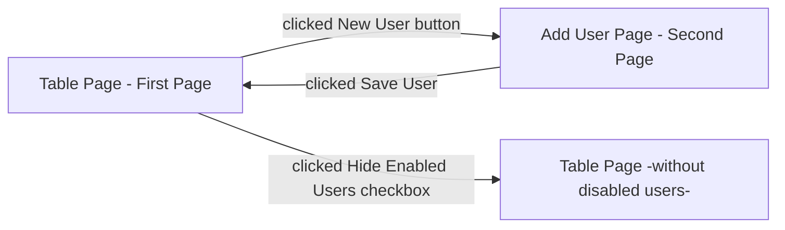


# User Interface Specification Document

The application that will be desired to show users which users are included in the system. The application has 2 pages and on the first-page user going to see a table that has 4 columns. These are ID (get from DB automatically), User Name, Email, and Enabled option. Each feature can be filtered and ordered by A-Z or Z-A. 

Also, there are 2 buttons and 1 checkbox. Buttons to add **new user** and after the entered information of user to save it **save button**. Checkbox will be used to see enabled users, if the checkbox tick active, the program will hide disabled users.

The second page will be active when the new user button is clicked. The second page will be like a sign-up page. It will include Username, Display Name, Phone, Email **textboxes**, User Role **list box** that includes Guest, Admin, Super Admin options and to specify is user enabled or not **checkbox**.  

**Application Flow Chart:**

