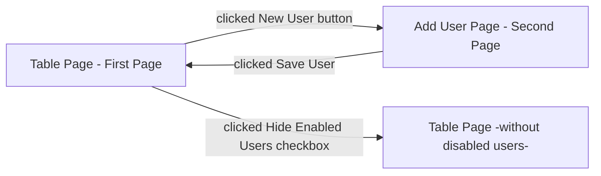

# User Interface Specification Document

Application that will be desired to show user which users included in the system. Application has 2 pages and on the first page user going to see a table that has 4 column. These are ID (get from DB automaticly), User Name, Email and Enabled option. Each feature can be filtered and ordered by A-Z or Z-A. 

Also, there are 2 button and 1 checkbox. Buttons to add **new user** and after the entered informations of user to save it **save button**. Checkbox will be used to see enabled users, if checkbox tick active, program will hide disabled users.

The second pages will be active when the new user button clicked. Second page will be like sign up page. It will include Username, Display Name, Phone, Email **textboxes**, User Role **list box** that include Guest, Admin, Super Admin options and to specify is user enabled or not **checkbox**.  

**Application Flow Chart:**

